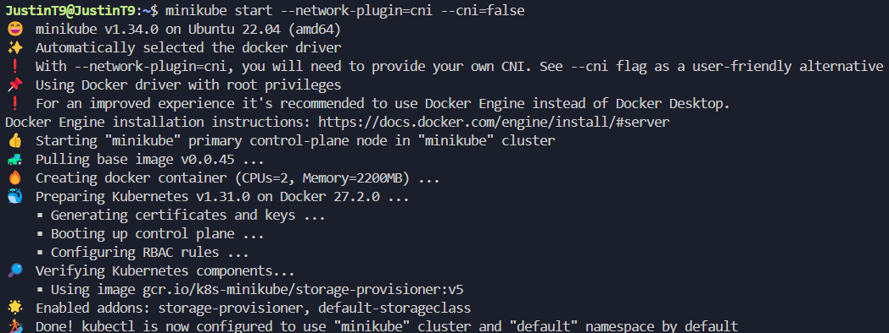
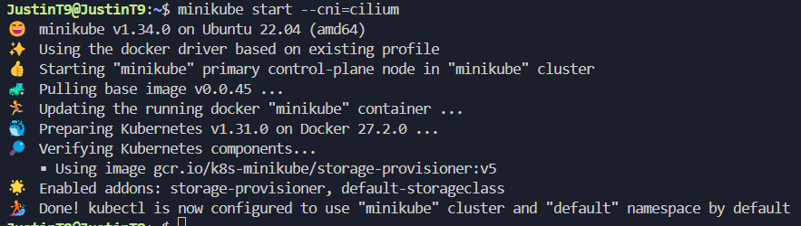
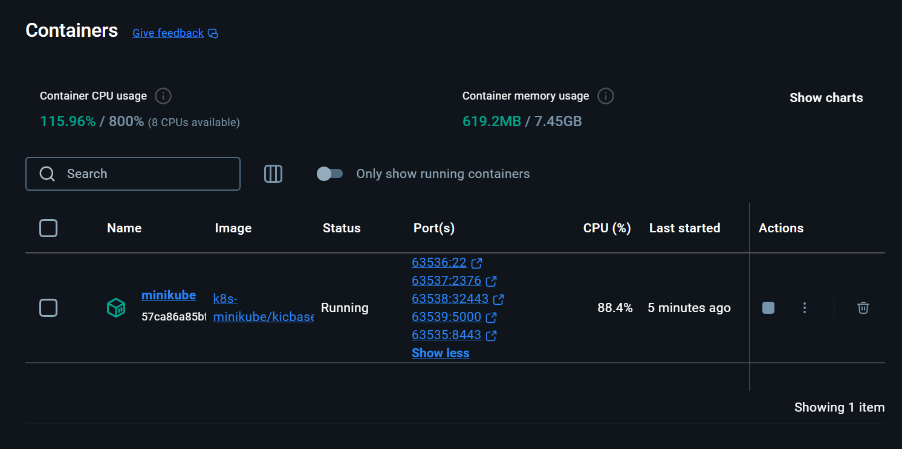
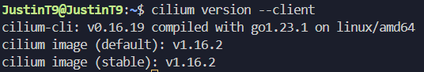
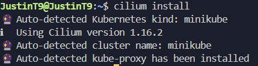
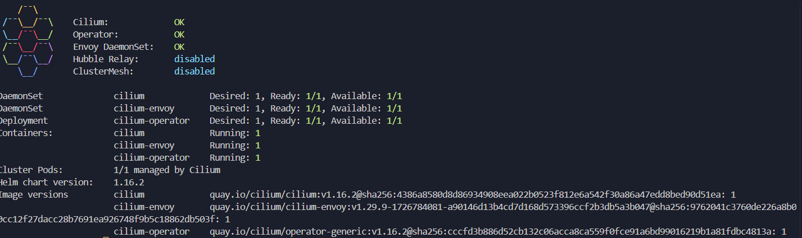

Cilium Environment Installation: 

Starting up the Cilium Kubernetes cluster on Docker via Minikube: 

This is the Kubernetes cluster on Docker: 

Additionally, my Cilium versions are good now 

With the previous steps completed, I was able to install cilium successfully with the up to date 
version: 

As for the status, it is valid because I ran the two minikube commands and even though the Cilium 
documentation did not specify the former, I had to run it because it would allow my Cilium status 
to be validated or else it would have given me a warning that hubble is not initialized and my Cilium 
status would have been invalid. I found this solution on a stackoverflow post: https://stackoverflow.com/questions/78944601/error-unable-to-enable-hubble-release-not-found

Lastly, as for the Cilium Connectivity Test I have been stuck on this issue for quite some time since it's difficult for me to 
pinpoint what the error exactly is and where it is coming from and also, how the error should be fixed since when I 
search for solutions online. I am not exactly sure which solutions are the right ones and also there are not a lot of 
solutions online related to my issue and if there are then the solutions are vague for me to follow e.g. 
https://github.com/cilium/cilium-cli/issues/1243
https://github.com/cilium/cilium-cli/issues/673
https://www.reddit.com/r/kubernetes/comments/1c419nx/cilium_connectivity_test_failing/
https://www.reddit.com/r/kubernetes/comments/18358oo/cilium_1144_connectivity_tests_failing/
https://github.com/cilium/cilium/issues/32100
https://github.com/cilium/cilium/issues/25015
https://github.com/cilium/cilium-cli/issues/1872

