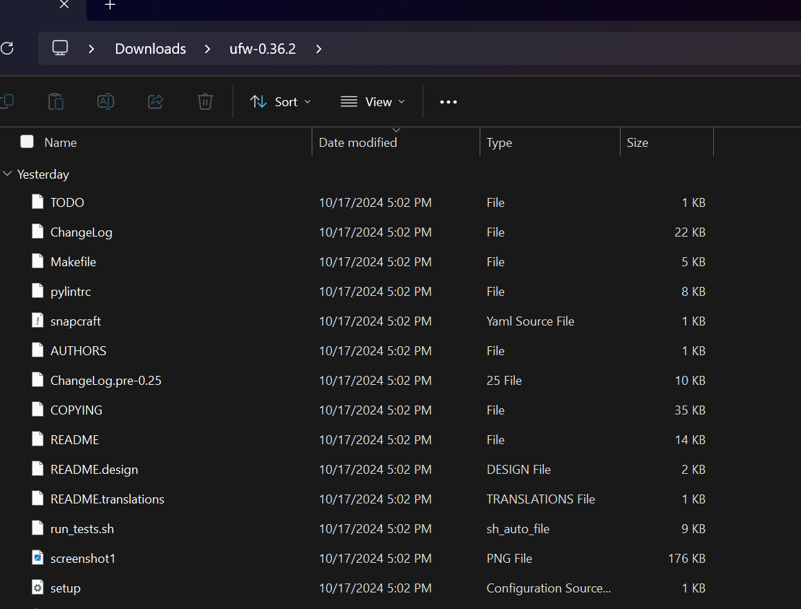
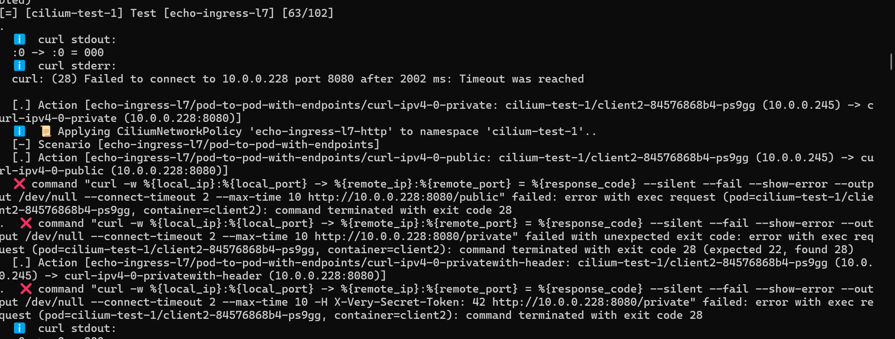
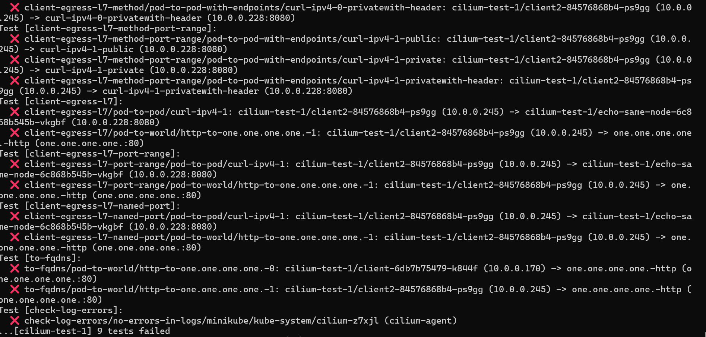
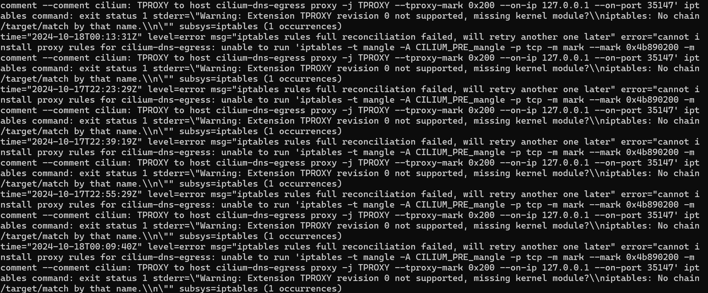
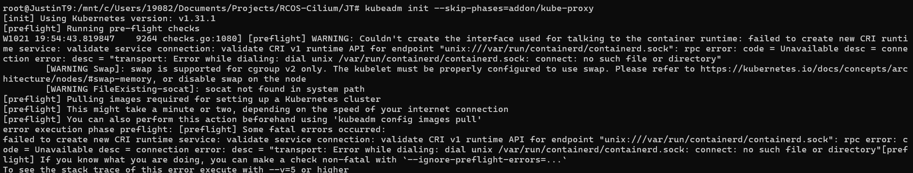

This week in search of a solution to my ongoing issues with the Cilium installation, I 
first checked on my Kubectl and Minikube interfaces on Ubuntu to see if they were configured 
correctly. Afterwards, I completely reinstalled docker by uninstalling and reinstalling, 
but this time I spent more time inspecting any documentation regarding the setup that I missed 
or glanced over and trying out anything possible to see if it would make a difference--
essentially guessing and checking methodology.

To further elaborate, I revisited this docker documentation on installing it via Ubuntu: 
https://docs.docker.com/desktop/install/linux/ubuntu/ i.e. following the install 
docker desktop section and following another piece of documentation to reinstalling it 
on ubuntu i.e. https://docs.docker.com/engine/install/ubuntu/#install-using-the-repository. 

Here is the DEB package I downloaded to run on Ubuntu containing important artifacts for 
Docker installation.

For reference this github issue is my main point of reference for guiding me on 
resolving this cilium installation issue i.e. https://github.com/cilium/cilium-cli/issues/673. 
And in the beginning with my cilium installation issue with the connectivity test I had 
no idea with what I was assuming and what I was doing, but after dealing with it for quite some
time I believe it has to deal with my firewalld and iptables configuration that allows some 
ip address to not be reachable, causing a timeout error i.e. curl(28) error. 

First, I checked out this pieces of documentation 
https://docs.docker.com/engine/network/packet-filtering-firewalls/#integration-with-firewalld 
https://wiki.ubuntu.com/UncomplicatedFirewall?action=show&redirect=UbuntuFirewall
and installed the UFW ubuntu interface for dealing with firewall/iptable rules and when 
I ran the connectivity tests it partially fixed some of the tests but the latter tests 
fail still. 

 

To elaborate after trying different things to my machine, I decided to start up a cilium cluster on docker 
via minikube, check the status and run the connectivity test. A couple of things happened which 
was that my tests were passing until the 63rd test which was a good sign because previously 
it would fail on the 10th test and the error was the same but on a different ip address, which 
was a good sign because something happened that caused another ip to fail instead of the same 
ip address which was on port 1.1.1.1 or one.one.one.one with curl(28). 
 

Also, this time I decided to run my tests until the end and I realized I had made a mistake 
with how I was running the connectivity test beforehand because I would immediately terminate 
it when I saw the curl(28) error since I didn't realize at the end that the test would 
log out the type of error that was occurring and when I saw this error, it had been caused 
by iptable/firewall rules. Now, I can confidently assume what kind of error is occurring, 
which will help me with fixing the error since I have a better idea of what to do now. 

As a result, I am targeting forums or pieces of documentation that are related to this issue e.g. 
https://github.com/NixOS/nixpkgs/issues/242853
https://github.com/cilium/cilium/issues/31736
https://github.com/microsoft/WSL/issues/11884
and some further investigation led me to believe that a source of my error is with a missing a 
Kernel module called TPROXY which I am not too knowledgable on and I am having difficulty 
in finding some sort of command or method of installing this Kernel module since these forums 
do specify the error but not a way of resolving it.

I also am working with this piece of documentation from Cilium to see if it would help as well 
https://docs.cilium.io/en/v1.11/gettingstarted/kubeproxy-free/ and as a result I had to clone 
the cilium repository https://github.com/cilium/cilium as another way on installing cilium 
in an effort to try different solutions that would help me progress. However, following this 
documentation has provided another set of problems I would have to find a solution for e.g. 
