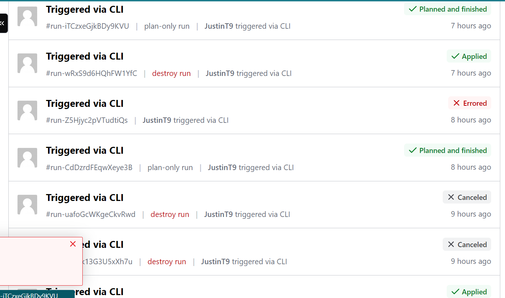
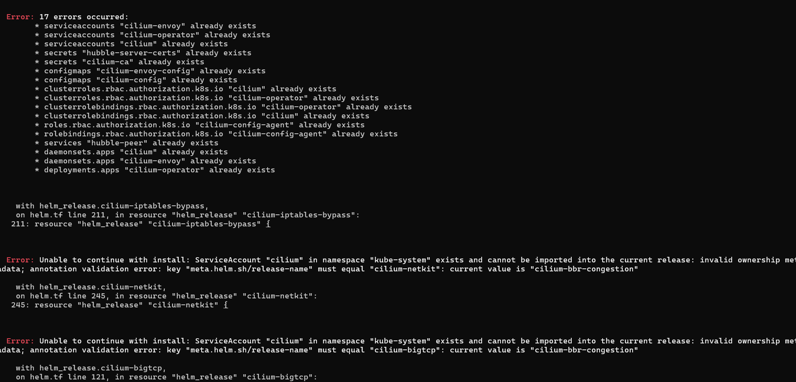
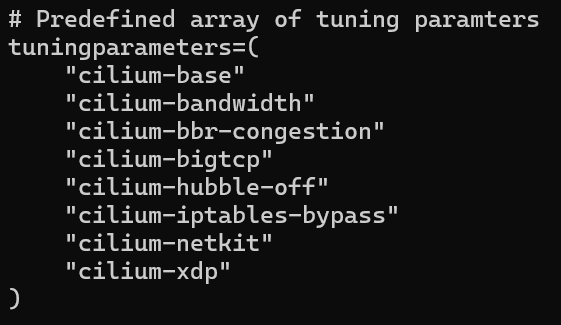
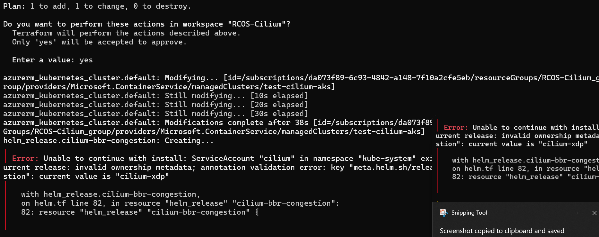
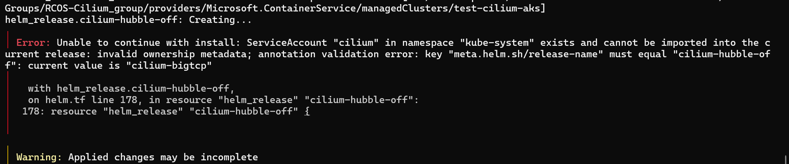

This week I realized that I did not need to fix the cilium connectivity issues for my 
cilium onboarding. Thus, I moved on to the onboarding section with installing cilium 
via terraform. I was able to retrieve the keys needed e.g. CLIENT_ID, SUBSCRIPTION_ID, 
TENANT_ID needed for the Terraform plan and apply. 

I had trouble with Terraform init at first and I did not know the reason as to why, but 
I realized that I was not the azure-migration branch which had to configuration 
needed for Terraform init to be working. Next, I went onto Terraform plan and 
the real issue I had with Terraform was making Terraform apply work with the different 
types of issues I had no idea about. So I was playing around and figuring out what was 
happening by constantly Terraform init, plan and apply and destroy: 

These errors in relation to cilium kept persisting:

So what was proposed to me was another solution with using the bash script i.e. 
testing.sh to specifically run each cilium dependency at a time instead 
of doing them all at once with Terraform: 

Even though, some of the dependencies were working via running 
bash testing.sh I still received errors on cilium-bbr-congestion, 
cilium-hubble-off and cilium-netkit: e.g.
 
 