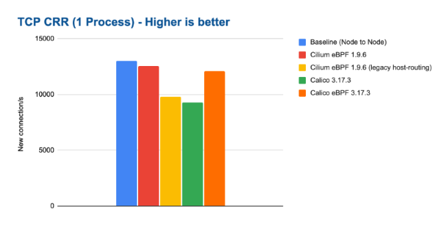

Azure successfully connecting with the subscription 

kubectl get the nodes successfully 

===Cilium Performance Testing Note===

Motivation: 
Reproducing Cilium Performance Tuning guide which is outdated by reproducing the results, enhancing them, providing more insight, testing on more configurations, etc. 

Reference: 
https://docs.cilium.io/en/stable/operations/performance/benchmark/ 

Context: 
Following metrics are collected and reported representing different traffic pattern required for workloads 
Throughput: max transfer rate via a single TCP connection and the total transfer rate of 32 accumulated connections 
Request/Response Rate: the number of request/response messages per second that can be transmitted over a single TCP connection and over 32 parallel TCP connections 
Connections Rate: the number of connections per second that can be established in sequence with a single request/response payload message transmitted for each new connection–a single process and 32 parallel processes are tested 
For various benchmarks, netperf has been used to generate workloads and to collect metrics. For spawning parallel netperf sessions, super_netperf has been used; both netperf and super_netperf are also frequently used and well established tools for benchmarking in the Linux kernel networking community 

TCP Throughput (TCP_STREAM): 
Useful to understand the maximum throughput that can be achieved with a particular configuration–all or most configurations can achieve line rate or close to line-rate if enough CPU resources are thrown at the load 
Important to understand the amount of CPU resources required to achieve a certain throughput aas these CPU resources will no longer be available to workloads on the machine 
This test represents bulk data transfer workloads e.g. streaming services or services performing data upload/download 
Single-stream: 
For this test, a single TCP stream is opened between the containers and maximum throughput is achieved 

eBPF-based solutions can outperform node-to-node baseline on modern kernels despite performing additional work e.g. forwarding into the network namespace of the container, policy enforcement, …) b/c eBPF is capable of bypassing iptables layer of the node which is traversed for the node to node baseline 

Total CPU consumption across the entire system while running the benchmark, normalized to a 50Gbit throughput
Multi-stream: 32 processes are opening 32 parallel TCP connections each process attempting to reach max throughput

All test configurations can achieve transfer rates close to the line-rate of the network interface where the main difference is the CPU resources used 

Request/Response Rate (TCP_RR): 
Measures the latency and efficiency to handle round-trip forwarding of an individual network packet
Benchmark will lead to the most packets per second on the wire and stresses the cost performed by a network packet 
Opposite of throughput test which maximizes size of each network packet 
A configuration that is doing well in this test (delivering high requests per second rates) will also deliver better (lower) network latencies 
This test represents services which maintain persistent connections and exchange request/response type interactions with other services–common for services using REST or gRPC APIs 
1 Process: single TCP connection is opened between the containers and a single byte is sent back and forth between the containers. For each round trip, one request is counted: 

eBPF on modern kernels can achieve almost the same request/response rate as the baseline while only consuming marginally more CPU resources: 

32 Processes: 32 processes are opening 32 parallel TCP connections each process performing single byte round-trips. The total number of requests per second is reported 

Cilium can achieve close to 1M requests/s in this test while consuming about 30% of the system resources on both the sender and receiver: 

Connection Rate (TCP_CRR): 
Measures the efficiency in handling new connections being similar to the request/response rate test but will create a new TCP connection for each round trip. 
Measures the cost of establishing a connection, transmitting a byte in both directions, and closing the connection. 
More expensive than the TCP_RR test and puts stress on the cost related to handling new connections. 
Represents a workload that receives or initiates a lot of TCP connections e.g. where the this is the case is a publicly exposed service that receives connections from many clients like L4 proxies or services opening many connections to external endpoints. This benchmark puts the most stress on the system with the least work offloaded to hardware so we can expect to see the biggest difference between tested configurations 
A config that does well in this test (delivering high connection rates) will handle situations with overwhelming connection rates much better, leaving CPU resources available to workloads on the system. 
1 Process: a single process opens as many TCP connections as possible in sequence: 

Graph shows the total CPU consumption across the entire system while running the benchmark: 

32 Processes: 32 processes running in parallel open as many TCP connections in sequence as possible–most stressful test for the system

Benchmark outlines the major differences between tested configs; in particular, it illustrates the overall cost of iptables which is optimized to perform most of the required work per connection and then caches the result. 
This leads to a worst-case performance scenario when a lot of new connections are expected
Total CPU consumption across the entire system while running the benchmark: 

WireGuard Throughput (Encryption): 
Looking at TCP throughput first, the following graph shows results for both 1500 bytes MTU and 9000 bytes MTU: 	

The following graph shows the total CPU consumption across the entire system while running the WireGuard encryption benchmark: 

Wireguard Request/Response: 
Measures the request/response rate while encrypting with WIreGuard

All test configurations performed more or less the same. The following graph shows the total CPU consumption across the entire system while running the WireGuard encryption benchmark: 

WireGuard vs IPsec: 

CPU resources required to achieve 10Gbit/s of throughput, WireGuard is less efficient at achieving the same throughput 

For the request/response rate, IPsec is outperforming WireGuard in tests; unlike for throughput test, the MTU does not have any effect as the packet sizes remain small: 

