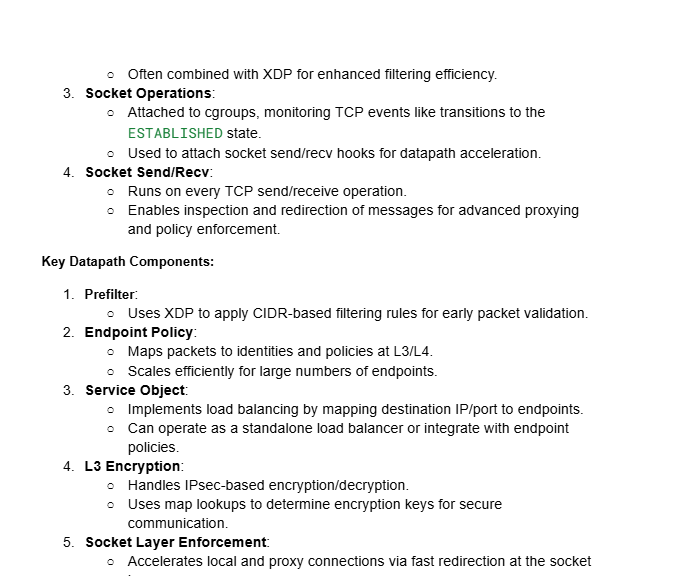

I decided to study up on some networking concepts specific to Cilium since these concepts and terminologies are
commonly used with Cilium, I thought it would be nice for me to study up on them since I have no intuition
of what they do within Cilium and why they are important. 

Here are some screenshots: 

Overall, I took some notes on important concepts I found on cilium's networking section: 
https://docs.cilium.io/en/stable/network/concepts/ especially taking notes on the concepts I have seen or heard 
most often while doing my cilium onboarding e.g. Kubernetes networking with the cluster nodes or routing or IPtables or 
eBPF, so I thought it would have been a good opportunity on training with those concepts. 