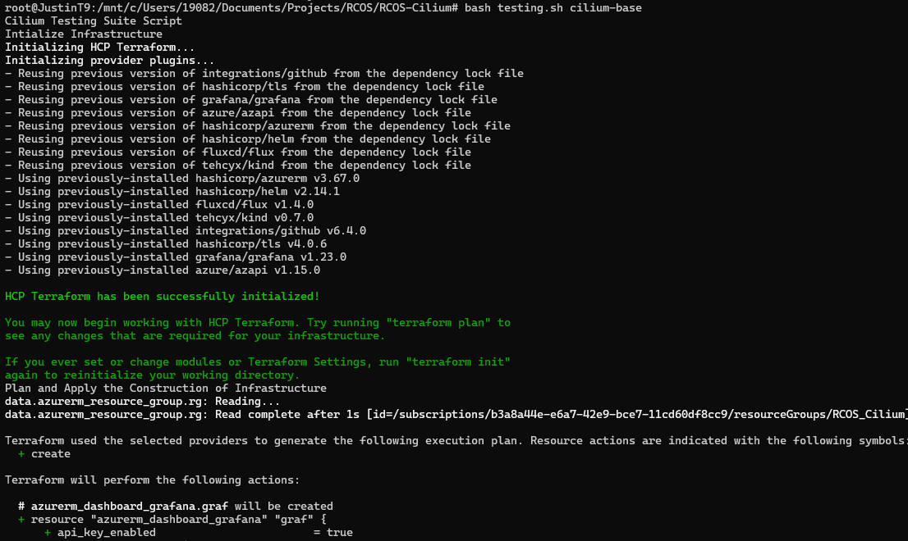
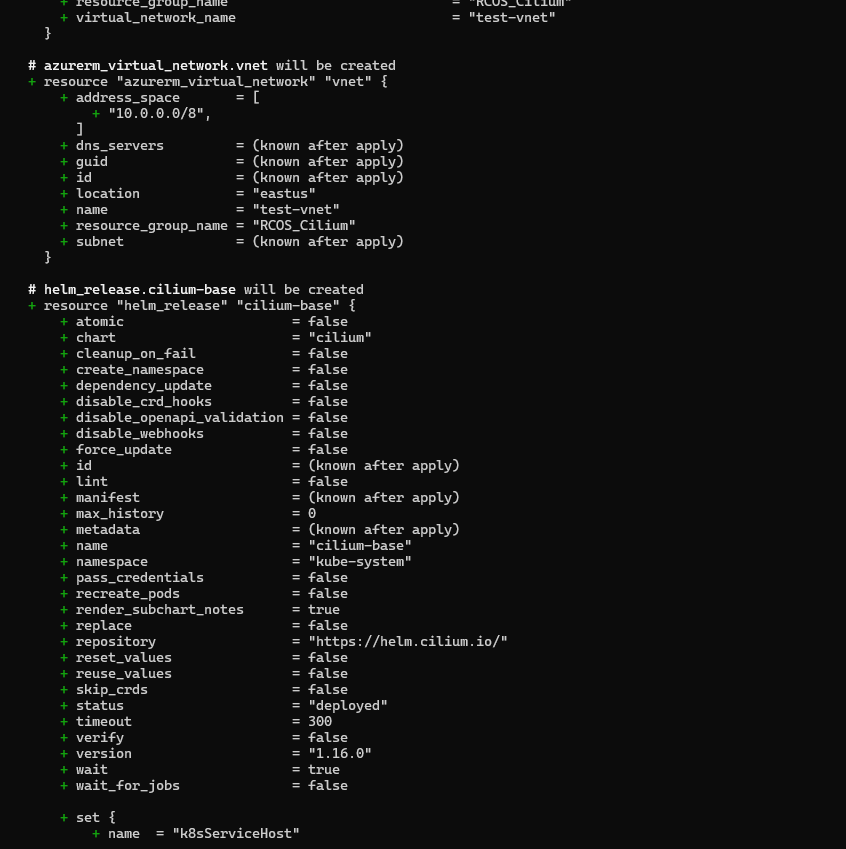

This week we got back our azure credentials since they had expired, so I was able to do 
resume my progress with the testing for cilium. However, I had ran into issues when following 
the instructions in regards to pulling the terraform state e.g. 


even though I was able to login into the azure account successfully with the correctly configured 
cilium azure group I was in. I also checked the terraform interface and it said that I was apart 
of the group. This was more odd since I was not able to do terraform init or those basic commands 
that I was able to do successfully during the onboarding. I did some more investigation and 
I realized that I was not logged in because my terraform login credentials had expired a couple of days 
prior to us getting back the azure credentials e.g. 


So I logged in with a new token and I was able to run the terraform commands successfully as I was 
logged in and that I was apart of the cilum group. In hindsight, this was a trivial error but I 
had not gone to that conclusion immediately which made me stumped for a bit on this problem. 


I was able to move forward by applying terraform state pull 
 

as well as remvoing any state files I had with terraform state list; however, I did not have any 
state files to remove so that was not any concern since nothing was listed when I ran the command: 


I also reconfigured the vars.tfvars with the new credentials. Subsequently, after running 
terraform init, plan and apply via the command given i.e. bash testing.sh cilium-base 
as a result of the many tuning parameters for testing that there are currently e.g. 




In the end, the commands ran successfully: 


Now, I am finally able to resume what I intended to do which is setup my machine to be able to 
run the cilium benchmark performance testing in order to observe the different metrics and 
their efficiency as mentioned on https://docs.cilium.io/en/stable/operations/performance/benchmark/ 

However, before running these tests I want come up to sync with some of the testing tools that are used 
and important programs involved i.e. netperf, cilium cli via the cilium repos. I did some investigation 
on this go program involved with the netperf extension: 
https://github.com/cilium/cilium/blob/main/cilium-cli/connectivity/perf/benchmarks/netperf/perfpod.go
Even though I have never worked with Go, I did some investigation as to what this program does in 
relation to cilium here are some of the observations I have noted: 

This go program, located in Cilium's cilium cli repo under the connectivity/perf package, which defines a 
netperf scenario for testing network performance using the netperf tool within a kubernetes cluster. 
In the context of Cilium's network performance testing, it automates running various benchmarks to measure 
and analyze the performance of communication between pods, hosts or both.

i.e. the purpose of the go program can be summarized as 
- performance benchmarking which executes network performance tests using netperf and measures metrics like 
throughput, latency and transaction rate between pods/hosts.
- supports different scenarios e.g. pod-to-pod, pod-to-host communication, host-to-host communication, etc.
- generates test cases based on parameters e.g. protocols i.e. TCP, UDP, test types i.e. STREAM, RR, CRR, etc.
- uses Cilium kubernetes pod metadata and network configurations by collecting and processing results to provide 
insights into Cilium’s network performance. Relation to perfpod.go

perfpod.go sets up kubernetes pods configured to execute performance tests where netPerf scenario defined
in the program interacts with these performance testing pods and it sends commands to the pods to execute 
specifically netperf tests; additionally, netPerf collects the results of these tests and processes metrics e.g.
latency, throughput which are used for analysis of Cilium’s networking performance. The netPerf scenario selects
a set of test cases based on user-defined parameters and sends commands to the appropriate performance pods to 
run netperf tests which produce results.

Below are some of my comments on the parts of code I looked into: 
```
import (
	"context"
	"fmt"
	"strconv"
	"strings"
	"time"

	"github.com/cilium/cilium/cilium-cli/connectivity/check"
	"github.com/cilium/cilium/cilium-cli/connectivity/perf/common"
	"github.com/cilium/cilium/cilium-cli/utils/features"
)

const (
	netperfToolName = "netperf"
)
``` 
Imports essential packages for context management, string operations and time handling as 
well as cilium specific packages involving connectivity/check, perf/common and utils/features.
Additionally, a constant is defined for the netperf tool name. Thus, these imports bring in 
vital dependencies required for the network performance testing e.g. pods, testing parameters and 
results being produced. 


```
func Netperf(n string) check.Scenario {
	return &netPerf{
		name: n,
	}
}
```

Creates a new netPerf scenario instance with a name attribute and returns it as a check.Scenario 
interface, which is seems to be a instance specific defined by Cilium for defining this testing 
context as a part of their framework.


```
type netPerf struct {
	name string
}

func (s *netPerf) Name() string {
	if s.name == "" {
		return netperfToolName
	}
	return fmt.Sprintf("%s:%s", netperfToolName, s.name)
}
```

netPerf is a struct representing the scenario config and the Name() method defines a name 
for the test, using the scenario name if provided or defaulting to netperf. So in the grand 
context of the program, it's used for logging test cases for the testing framework. 


```
func (s *netPerf) Run(ctx context.Context, t *check.Test) {
    perfParameters := t.Context().Params().PerfParameters

	tests := []string{}

	if perfParameters.Throughput {
		tests = append(tests, "TCP_STREAM")
		if perfParameters.UDP {
			tests = append(tests, "UDP_STREAM")
		}
	}

	if perfParameters.CRR {
		tests = append(tests, "TCP_CRR")
	}

	if perfParameters.RR {
		tests = append(tests, "TCP_RR")
		if perfParameters.UDP {
			tests = append(tests, "UDP_RR")
		}
	}

	for sample := 1; sample <= perfParameters.Samples; sample++ {
		for _, c := range t.Context().PerfClientPods() {
			c := c
			for _, server := range t.Context().PerfServerPod() {
				if !perfParameters.Mixed && (strings.Contains(server.Pod.Name, check.PerfHostName) != strings.Contains(c.Pod.Name, check.PerfHostName)) {
					continue
				}
				scenarioName := ""
				if strings.Contains(c.Pod.Name, check.PerfHostName) {
					scenarioName += "host"
				} else {
					scenarioName += "pod"
				}
				scenarioName += "-to-"
				if strings.Contains(server.Pod.Name, check.PerfHostName) {
					scenarioName += "host"
				} else {
					scenarioName += "pod"
				}

				sameNode := true
				if strings.Contains(c.Pod.Name, check.PerfOtherNode) {
					sameNode = false
				}

				for _, test := range tests {
					testName := netperfToolName + "_" + test + "_" + scenarioName
					action := t.NewAction(s, testName, &c, server, features.IPFamilyV4)

					action.CollectFlows = false
					action.Run(func(a *check.Action) {
						k := common.PerfTests{
							Test:     test,
							Tool:     netperfToolName,
							SameNode: sameNode,
							Sample:   sample,
							Duration: perfParameters.Duration,
							Scenario: scenarioName,
							MsgSize:  perfParameters.MessageSize,
							NetQos:   false,
						}
						perfResult := NetperfCmd(ctx, server.Pod.Status.PodIP, k, a)
						t.Context().PerfResults = append(t.Context().PerfResults, common.PerfSummary{PerfTest: k, Result: perfResult})
					})
				}
			}
		}
	}
}
```
This method executes the performance scenario which dynamically generates and runs tests 
based on parameters like the protocol (TCP/UDP), test type (STREAM, RR, CRR), Sample count, 
duration, and message size and pod-to-pod, pod-to-host, or host-to-host communication.

Some parts to scruntize further are the different parameters:
```
perfParameters := t.Context().Params().PerfParameters
```
This retrieves user-specified test parameters e.g. test type, protocol, and message size.
```
if perfParameters.Throughput {
    tests = append(tests, "TCP_STREAM")
    if perfParameters.UDP {
        tests = append(tests, "UDP_STREAM")
    }
}
```
Selects relevant tests (TCP_STREAM, UDP_STREAM, TCP_RR, etc.) based on parameters.
```
for _, c := range t.Context().PerfClientPods() {
    for _, server := range t.Context().PerfServerPod() {
        if !perfParameters.Mixed && (strings.Contains(server.Pod.Name, check.PerfHostName) != strings.Contains(c.Pod.Name, check.PerfHostName)) {
					continue
				}
				scenarioName := ""
				if strings.Contains(c.Pod.Name, check.PerfHostName) {
					scenarioName += "host"
				} else {
					scenarioName += "pod"
				}
				scenarioName += "-to-"
				if strings.Contains(server.Pod.Name, check.PerfHostName) {
					scenarioName += "host"
				} else {
					scenarioName += "pod"
				}

				sameNode := true
				if strings.Contains(c.Pod.Name, check.PerfOtherNode) {
					sameNode = false
				}
        ...
    }
}
```
Iterates over all client and server pod pairs, filtering scenarios e.g. pod-to-host or same-node-only.

```
action.Run(func(a *check.Action) {
    k := common.PerfTests{
        Test:     test,
        Tool:     netperfToolName,
        SameNode: sameNode,
        Sample:   sample,
        Duration: perfParameters.Duration,
        Scenario: scenarioName,
        MsgSize:  perfParameters.MessageSize,
        NetQos:   false,
    }
    perfResult := NetperfCmd(ctx, server.Pod.Status.PodIP, k, a)
    t.Context().PerfResults = append(t.Context().PerfResults, common.PerfSummary{PerfTest: k, Result: perfResult})
})
```
Configures and runs each netperf test, collecting results and appending them to the test context.


```
func NetperfCmd(ctx context.Context, sip string, perfTest common.PerfTests, a *check.Action) common.PerfResult {
    args := []string{"-o", "MIN_LATENCY,MEAN_LATENCY,MAX_LATENCY,P50_LATENCY,P90_LATENCY,P99_LATENCY,TRANSACTION_RATE,THROUGHPUT,THROUGHPUT_UNITS"}
	if perfTest.Test == "UDP_STREAM" || perfTest.NetQos {
		args = append(args, "-m", fmt.Sprintf("%d", perfTest.MsgSize))
	}
	exec := buildExecCommand(perfTest.Test, sip, perfTest.Duration, args)

	a.ExecInPod(ctx, exec)
	output := a.CmdOutput()
	a.Debugf("Netperf output: ", output)
	lines := strings.Split(output, "\n")
	if len(lines) < 2 {
		a.Fatal("Unable to process netperf result")
	}
	resultsLine := lines[len(lines)-2]
	values := strings.Split(resultsLine, ",")
	if len(values) != 9 {
		a.Fatalf("Unable to process netperf result")
	}
	a.Debugf("Numbers: %v", values)

	res := common.PerfResult{
		Timestamp: time.Now(),
		Latency: &common.LatencyMetric{
			Min:    parseDuration(a, values[0]),
			Avg:    parseDuration(a, values[1]),
			Max:    parseDuration(a, values[2]),
			Perc50: parseDuration(a, values[3]),
			Perc90: parseDuration(a, values[4]),
			Perc99: parseDuration(a, values[5]),
		},
		TransactionRateMetric: &common.TransactionRateMetric{
			TransactionRate: parseFloat(a, values[6]),
		},
		ThroughputMetric: &common.ThroughputMetric{
			Throughput: parseFloat(a, values[7]) * 1000000, // by default throughput has unit "10^6bits/s", we verify that later
		},
	}

	if strings.HasSuffix(perfTest.Test, "_STREAM") {
		// We don't want to report transaction rate or latency
		res.TransactionRateMetric = nil
		res.Latency = nil
		// Verify that throughput unit is 10^6bits/s
		if values[8] != "10^6bits/s" {
			a.Fatal("Unable to process netperf result")
		}
	}
	if strings.HasSuffix(perfTest.Test, "_RR") || strings.HasSuffix(perfTest.Test, "_CRR") {
		// We don't want to report throughput
		res.ThroughputMetric = nil
	}

	return res
}
```
This builds and executes the netperf command inside a kubernetes pod as well as parses and returns the test results.
Like the previous method that was quite considerably large, some parts to highlight are:

```
exec := buildExecCommand(perfTest.Test, sip, perfTest.Duration, args)
```
Constructs the netperf command with test type, server IP, duration, and additional arguments.
```
a.ExecInPod(ctx, exec)
output := a.CmdOutput()
```
Executes the netperf command in the target pod and collects the output.
```
res := common.PerfResult{
    Timestamp: time.Now(),
		Latency: &common.LatencyMetric{
			Min:    parseDuration(a, values[0]),
			Avg:    parseDuration(a, values[1]),
			Max:    parseDuration(a, values[2]),
			Perc50: parseDuration(a, values[3]),
			Perc90: parseDuration(a, values[4]),
			Perc99: parseDuration(a, values[5]),
		},
		TransactionRateMetric: &common.TransactionRateMetric{
			TransactionRate: parseFloat(a, values[6]),
		},
		ThroughputMetric: &common.ThroughputMetric{
			Throughput: parseFloat(a, values[7]) * 1000000, // by default throughput has unit "10^6bits/s", we verify that later
		},
    ...
}
```
Extracts latency, transaction rate and throughput benchmark metrics from netperf output, 
while also converts values to appropriate units and structures them for later use.

Additionally, these helper functions were used in the method above for aux functionality e.g. 
```
func buildExecCommand(test string, sip string, duration time.Duration, args []string) []string { ... }
func parseDuration(a *check.Action, value string) time.Duration { ... }
func parseFloat(a *check.Action, value string) float64 { ... }
```
buildExecCommand: constructs the netperf command with appropriate flags.
parseDuration/parseFloat: parses numerical results from netperf output.


