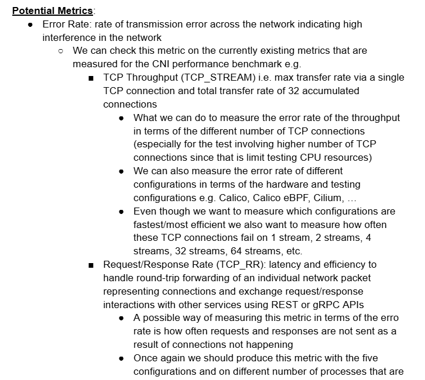
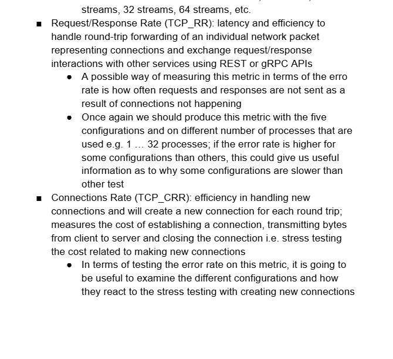

This week I began my attempt at producing the CNI performance benchmark testing in regards 
to the different metrics that were utilized e.g. TCP throughput, TCP RR, TCP CRR 
following this piece of documentation: https://docs.cilium.io/en/latest/operations/performance/benchmark/#test-hardware

I was able to clone the cilium-perf-networking repo however I got stuck at the Packet Servers section where when it comes 
to building the testing environment with terraform, the terraform apply -var 'packet_token=API_TOKEN' -var 'packet_project_id=PROJECT_ID'
errored since we currently do not have the credentials to perform an action. I need this to not fail in order to move on with the 
subsequent instructions e.g. the ansible playbook commands that will run the performance tests. 

As a result, I am currently brainstorming on new metrics to measure ciliums performance and I wrote up some ideas regarding it 
and expanding the current tests that are currently being done and one thing I am fond of the most is the error rate. I wrote some 
good notes: 

