Started up some local k8 environments via localhost using minikube 
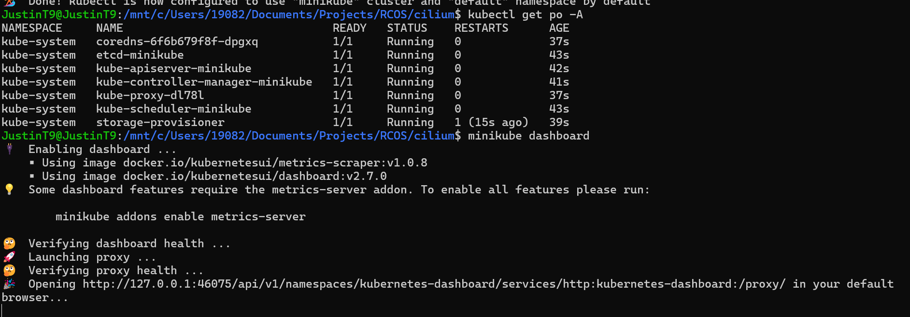

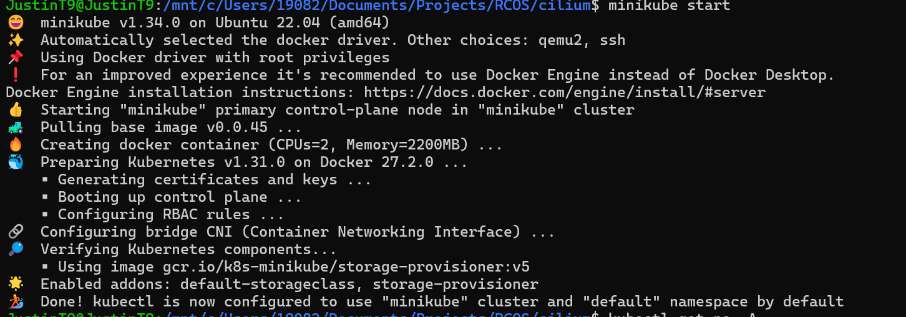

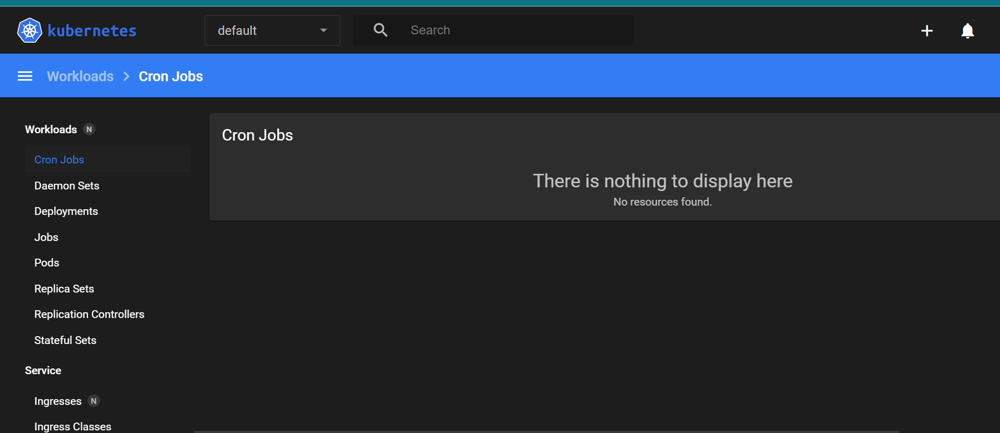

Also deployed some services and got requests/responses involved: 
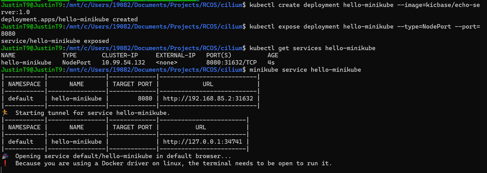
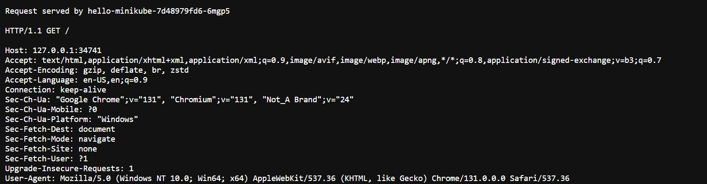

Forwarded a port from 7080 to 8080: 
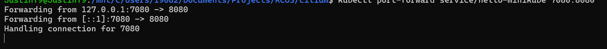
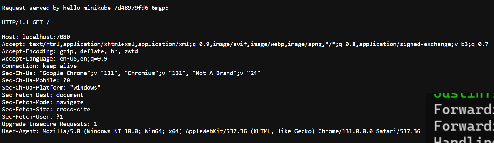

Here are some more commands I ran for different applications e.g. LoadBalancer and Ingress 
using the same workflow 
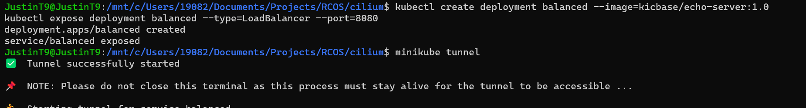
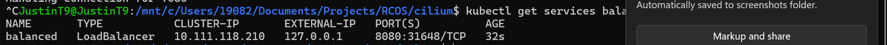

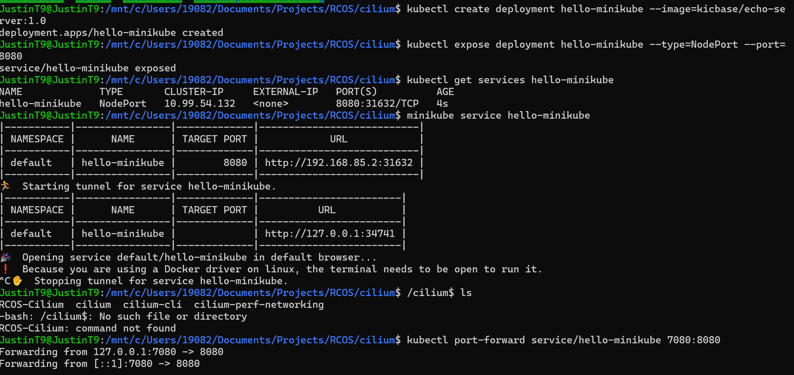
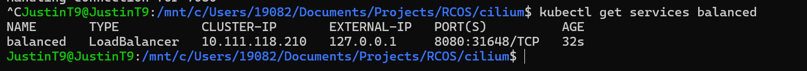
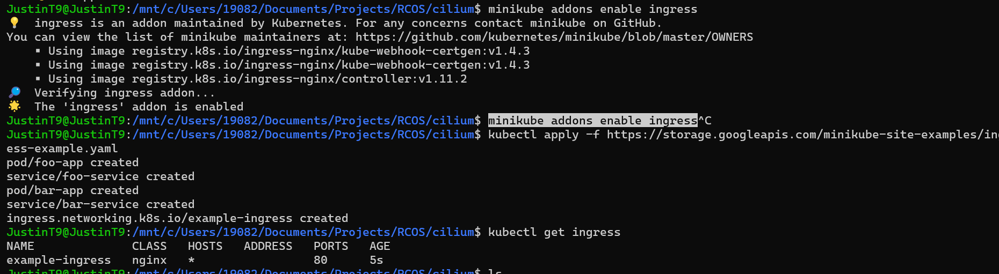