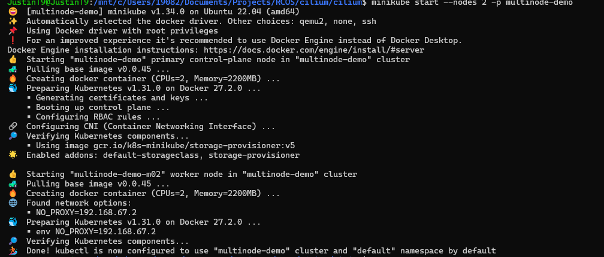
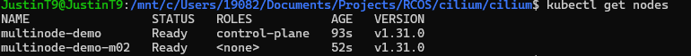
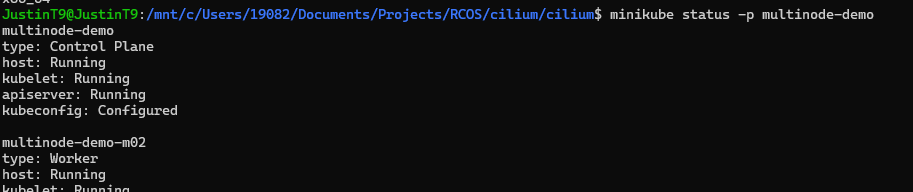
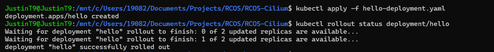
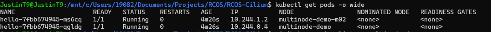
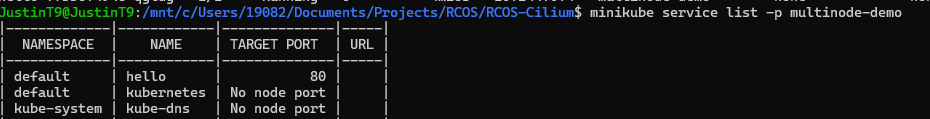

I used the following yaml configurations within this directory to achieve the following results: 

 
Produced on docker: 

The status of the following nodes that were started up: 

Here are the status of the nodes: 

I deployed the service using the yaml configurations: 

Here are the pods that were successfully created: 

