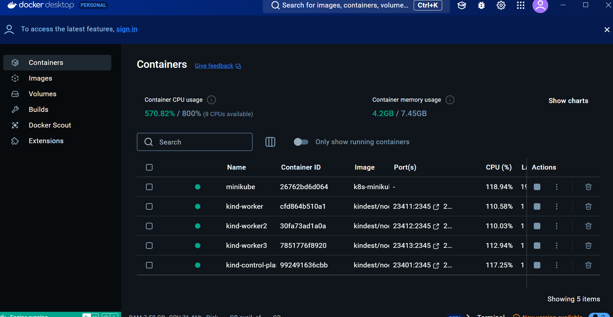
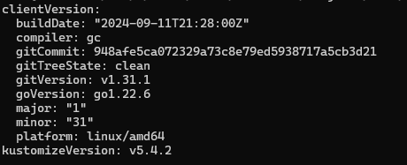
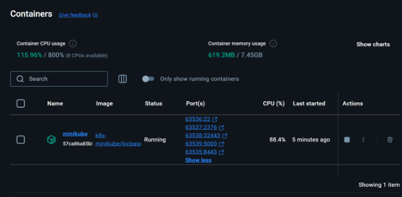
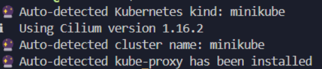
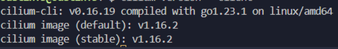
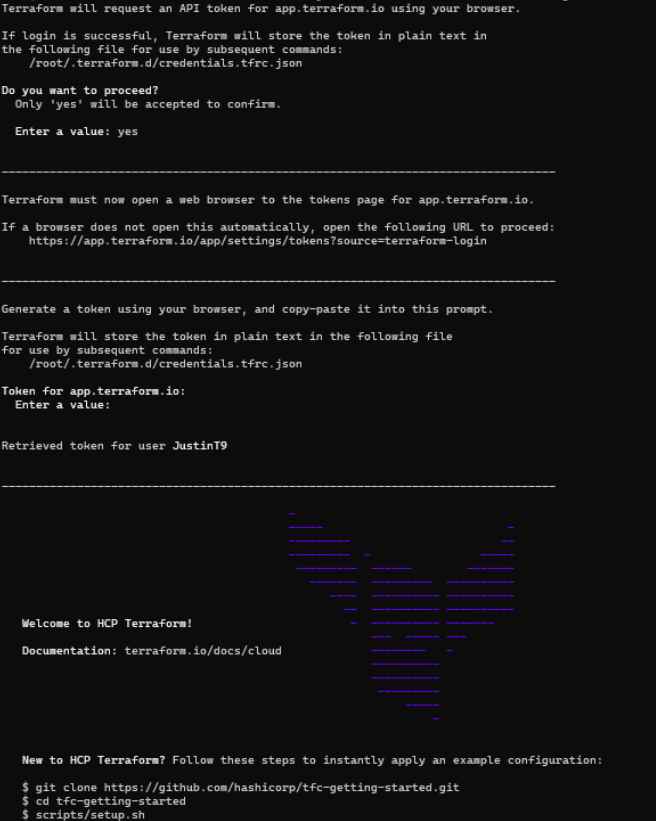
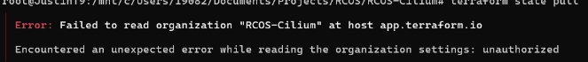
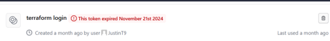

*Recommended to use Linux or Ubuntu/WSL*  
*Powershell or any windows related distro is not recommended for onboarding*
*Please read onboarding.md before using this document*  

Follow general recommended steps (in this strict order) to properly install Cilium:
#### INSTALLATION 
1. [Install Terraform](https://developer.hashicorp.com/terraform/tutorials/aws-get-started/install-cli)
    a. Make sure to be apart of the Cilium organization on https://app.terraform.io/app/organizations in order to have access to the subscription and its resources 
2. [Install Docker](https://minikube.sigs.k8s.io/docs/drivers/docker/) (to run minikube to start up cluster) 
3. [Install Minikube](https://minikube.sigs.k8s.io/docs/start/?arch=%2Flinux%2Fx86-64%2Fstable%2Fbinary+download)  
4. [Install Kubectl](https://kubernetes.io/docs/tasks/tools/)
5. [Install Cilium CLI](https://docs.cilium.io/en/stable/gettingstarted/k8s-install-default/#install-the-cilium-cli)  
6. [Install Azure CLI](https://learn.microsoft.com/en-us/cli/azure/install-azure-cli) 

*REMINDER: When running the terraform commands adding the `-var-file="vars.tfvars"` flag which consists of credentials needed to perform the terraform commands with the proper access*

*The tfvars file should be given to you by one of the members who owns the subscription to Terraform*

#### Starting Up Cilium Environment
7. Running Terraform (recommended) 

    a. Navigate to the azure-migration branch on the RCOS-Cilium repo and run `bash testing.sh cilium-base` which both performs terraform init, plan and apply

8. Running Terraform (old)

    a. In command line: `terraform init` - sets up Terraform to run your configuration by initializing the backend and installing the plugins for the providers defined in your configuration.  
    b. In command line: `terraform plan` - displays what actions Terraform will perform when you apply your configuration. It doesn't make any changes to real resources but shows you a preview of what will happen.  
    c. In command line: `terraform apply` - Terraform will ask you to confirm that you want to perform the actions detailed in the plan. Type `yes` to proceed. This process can take several minutes as Terraform works to set up your EKS cluster and all associated resources  
9. Register a Microsoft Azure Account with your school email to be apart of the RCOS-Cilium group
10. In command line: `az login` and for the first time, it will prompt you to create a new access token that you must save. Afterwards, select the correct subscription corresponding to the cilium group or do `az account set --subscription <token>`
11. Once the `terraform apply` and `az login` are successful, you'll need to configure kubectl to interact with your new EKS cluster. You can use the AKS CLI to update your kubeconfig file with the context of your new cluster: `az aks get-credentials --resource-group RCOS-Cilium_group --name test-aks`  
12. Verify that you can connect to your Kubernetes cluster by running: `kubectl get nodes`  
13. Additional Details about the cluster: `kubectl cluster-info`

### Ubuntu/Linux Specific Instructions/Tips
1. Docker 

    a. To the left, click on the Ubuntu section and follow the instructions specified on the documentation 

    b. Additionally, if running on a Windows OS, make sure to download the Docker Desktop interface to have a overview of the containers being ran: [Docker Download](https://docs.docker.com/desktop/setup/install/windows-install/)
    
2. Minikube 

    a. In order to run minikube clusters, Docker must be present to hold those specific clusters/containers as a virtual machine manager 

    b. Follow the instructions from the link above 
3. Kubectl 
    
    a. Follow the instructions as specific on the Kubectl installation link listed above 
    b. To know if kubectl is installed correctly, you should run `kubectl version --client --output=yaml` and get the following output 
    
4. Cilium CLI 
    
    a. Even though on the documentation, it mentions to first perform `minikube start --cni=cilium`, what is recommended however in order to have cilium properly running is to first to `minikube start --network-plugin=cni --cni=false` and subsequently perform `minkube start --cni=cilium` 
    
    b. Afterwards, install the cilium cli via command line as prompted 
    `CILIUM_CLI_VERSION=$(curl -s https://raw.githubusercontent.com/cilium/cilium-cli/main/stable.txt)
CLI_ARCH=amd64
if [ "$(uname -m)" = "aarch64" ]; then CLI_ARCH=arm64; fi
curl -L --fail --remote-name-all https://github.com/cilium/cilium-cli/releases/download/${CILIUM_CLI_VERSION}/cilium-linux-${CLI_ARCH}.tar.gz{,.sha256sum}
sha256sum --check cilium-linux-${CLI_ARCH}.tar.gz.sha256sum
sudo tar xzvfC cilium-linux-${CLI_ARCH}.tar.gz /usr/local/bin
rm cilium-linux-${CLI_ARCH}.tar.gz{,.sha256sum}` and on docker, it should show this: 

    c. This is important, now perform `cilium install` to properly have the cilium version be correct and the dependencies to be present e.g. 
    
    
    
    d. Now most of the installation is done, the last thing to do is to perform `cilium status --wait` and the `--wait` flag is necessary in order to give time to the cilium installation to fully install all of the necessary dependencies or else it will not and the installation will fail. 

    e. Afterwards, if `cilium status --wait` runs successfully, then you are able to do any cilium command with these basic commands passing i.e. there is no need to run `cilium connectivity test` since that's an isolated test to check the connectivity performance of cilium and not mutually related to other cilium commands that you may perform consequently.
5. Terraform

    a. Before performing any terraform actions, make sure to login in to have access to the RCOS cilium group which should be already linked e.g. 
     or else you may receive authorization errors preventing you from starting up the terraform resources e.g. 
    
    Sometimes, Terraform will log you out since when you login into Terraform you will need a token to be authorized which has a certain expiration date attached e.g. 
    

### IMPORTANT: Cleaning Up Resources
*REMINDER: When running the terraform commands adding the `-var-file="vars.tfvars"` flag  which consists of credentials needed to perform the terraform commands with the proper access*

Destroy Terraform: Run this when you are finished with the cluster to avoid errant costs 
`terraform destroy` or 
`terraform state list` to list the resources terraform created and applied 
`terraform state rm statefile1 statefile2 ... statefileN` to delete the state files 

